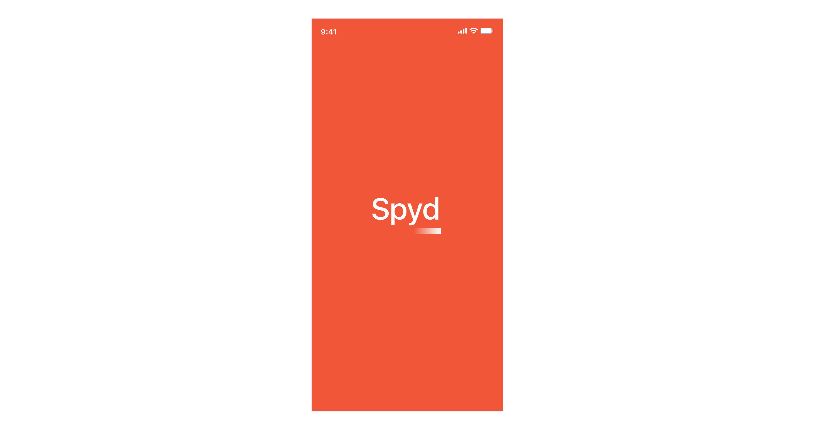
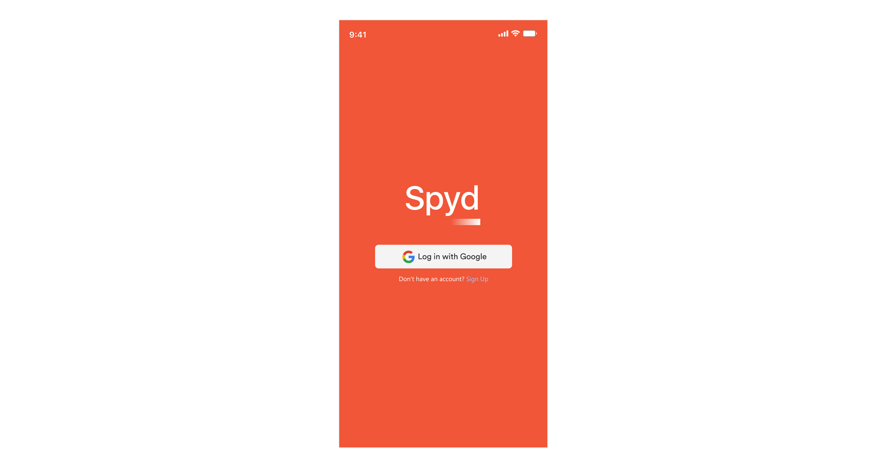
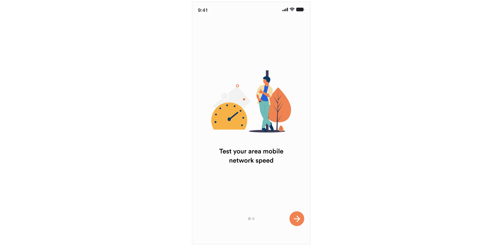
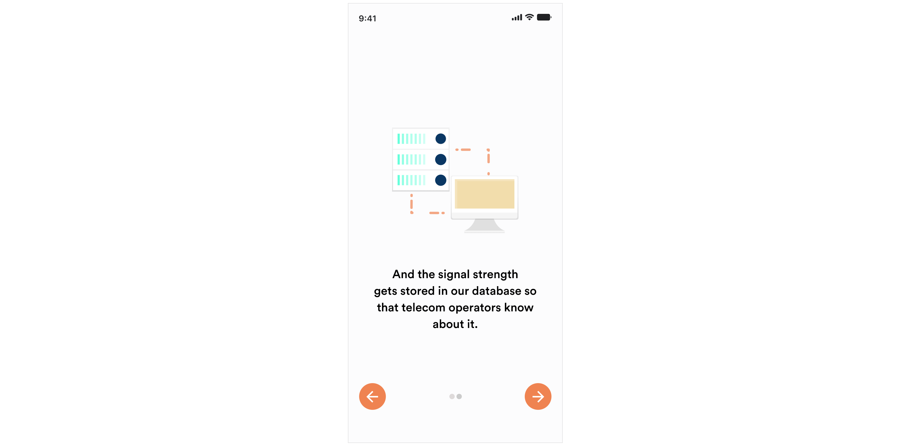
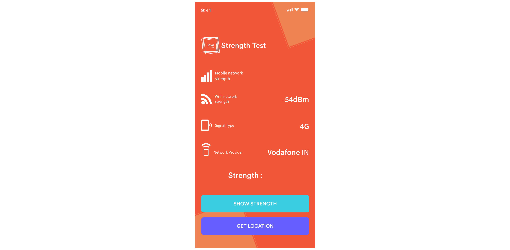
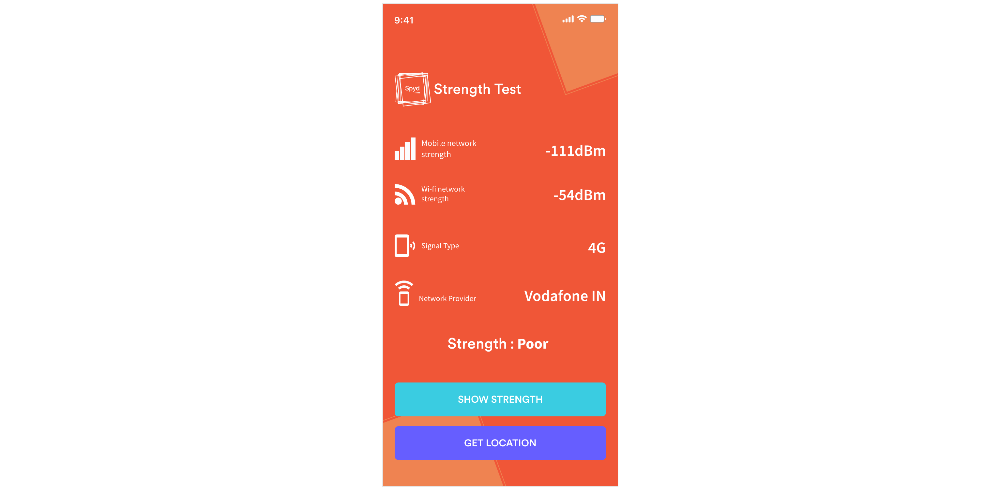

# Spyd

## Description
An android app that detects whether the signal of your app is weak or strong. If the signal in your area is poor or weak, the current location of the user gets stored in the database. According to the network provider, the data is saved in the Firebase Realtime-Database.

## Demo Video
[CLick Here](https://youtu.be/WkdWYOMOMOE)

## Screenshots

## Pull Request

Pull Requests are welcome. Please follow these rules for the ease of understanding:
* Make sure to check for available issues before raising one
* Give me a maximum of 24-48 hours to respond
* Have proper documentation on the parts you are changing/adding

## Developed & Maintained by

[👨 Sayan Nath](https://sayannath.biz/)

  
#### Show some ❤️ by starring the repository!

